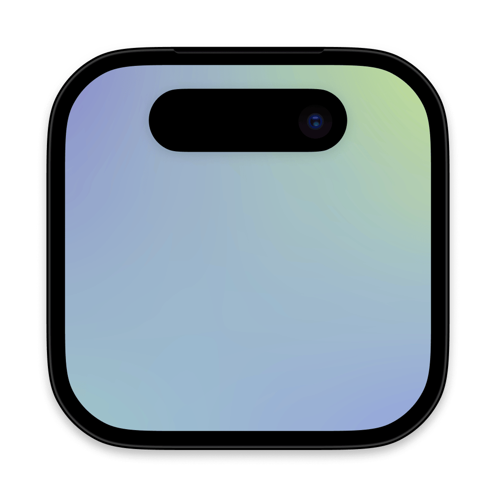
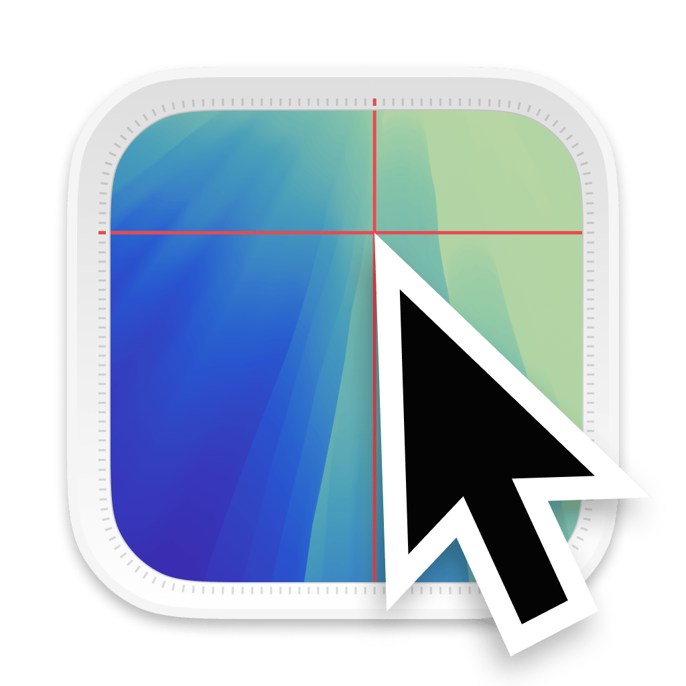
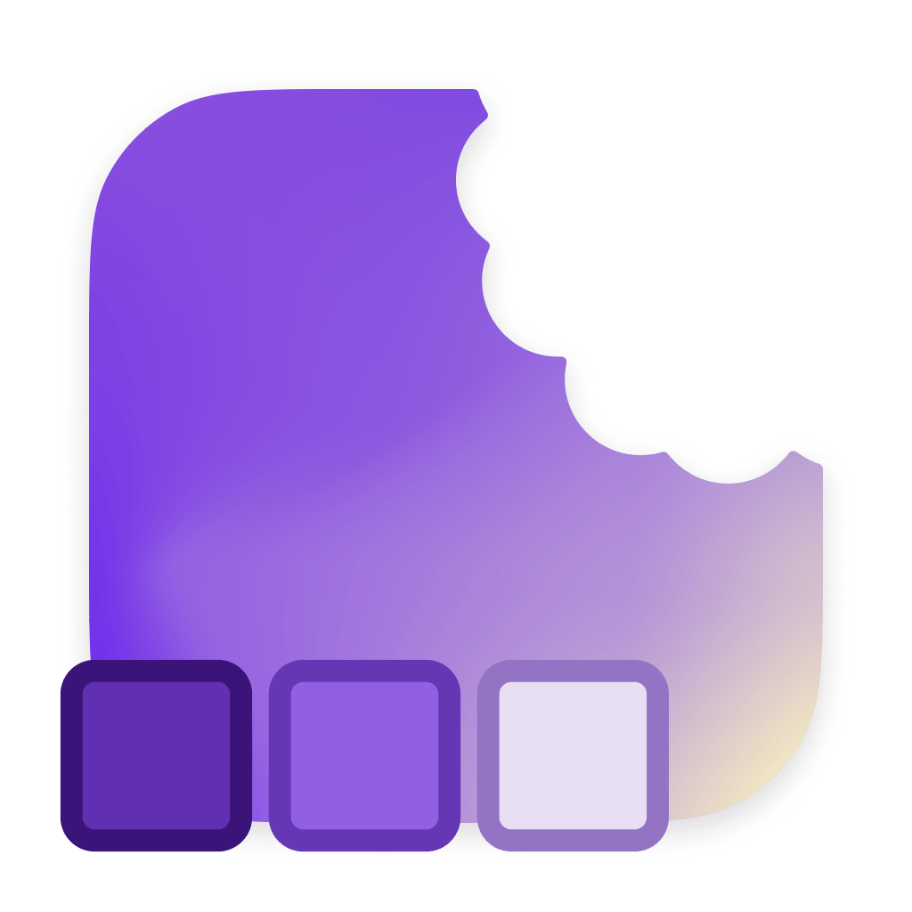
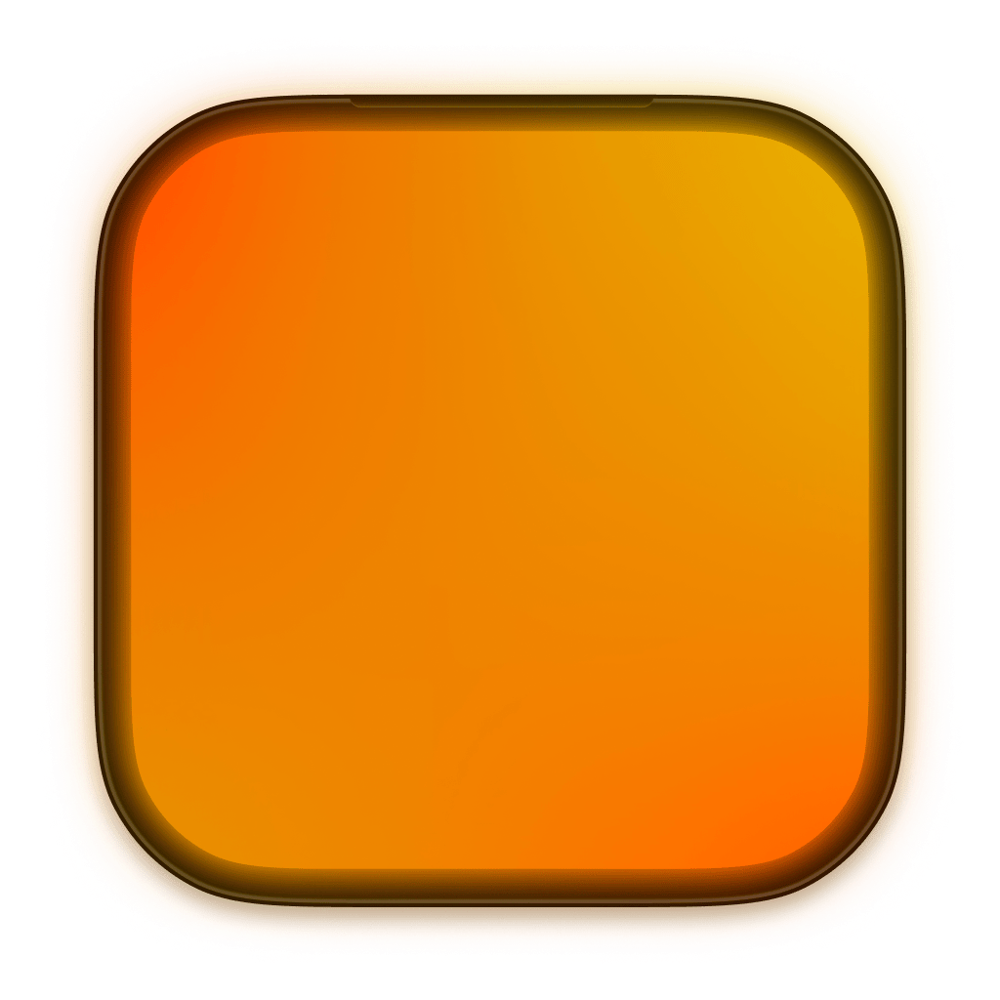

<!-- README.md -->
<h1 align="center">👋 yo, i'm aether. i build things. sometimes i share them.</h1>

  i’m a design engineer. which basically means i don’t just make things look good—I make them <strong>work</strong>. sometimes, while doing that, i end up building little tools, libraries, or components that solve annoying problems. if they seem useful, i throw them out into the world.

  i don’t call myself a dev, but if i’m writing code and shipping it, does it even matter?

  i used to intern at apple (maps design engineering), where i learned how to push pixels and code in ways that actually make a difference. now i’m finishing my degree, open-sourcing some things, and working on projects that keep me sane.

<h2>📦 open source things i've thrown into the void</h2>

  wanted to solve annoying problems, so i built these. if they seem useful, feel free to check them out.

  

    

      
      <h3><a href="#">NotchMyProblem</a></h3>
      
wanted buttons that perfectly hug the iphone notch. positioning buttons around the iphone notch shouldn’t be that hard. so i made this.

    

    

      
      <h3><a href="#">CursorBounds</a></h3>
      
needed precise text cursor positions on macos. accessibility api helped, but it’s weird. now it’s a package.

    

    

      
      <h3><a href="#">Garnish</a></h3>
      
ui colors should just <em>work</em>. this helps.

    

    

      
      <h3><a href="#">GlowGetter</a></h3>
      
colors being brighter than the rest of the screen seemed cool for some ui ideas. this lets you do that, or whatever idea you have.

    

    

      
      <h3><a href="#">SwiftUI AdaptiveImageGlyph</a></h3>
      
example for rich text editing in swiftui, bc genmojis exist now. (more of an example, proper package later.)

    

  

<h2>🚀 other things i’ve built</h2>
<ul>
  <li>
    <strong>Kyo</strong> – a school planner & organizer built with swiftui. students deserve good ui too. currently working on kyo 2.0, which is getting a full redesign & more depth.
  </li>
  <li>
    <strong>Amethyst & Avalanche</strong> – collections of swiftui components. one was for kyo 1.0, the other is me experimenting with depth again. wip.
  </li>
  <li>
    <strong>FlavorKit</strong> – a theming system for swiftui that actually makes sense. presets + user-created themes that just work.
  </li>
</ul>

  more coming soon, probably.

<h2>🛠 what i actually do</h2>
<ul>
  <li>build <strong>apps, interfaces, and tools</strong> that make interacting with tech feel effortless</li>
  <li>obsess over <strong>systems, not just visuals</strong></li>
  <li>occasionally regret every decision that led to a complicated problem but solve it anyway</li>
  <li>sometimes occasionally build something so specific that only 3 people in the world will ever need it</li>
</ul>

<h2>🤝 open to cool things</h2>

  if you’re building something interesting in swiftui, ui/ux, or spatial computing, i’m down to chat. otherwise, i’ll be here, making things work.

<h2>📍 where to find me</h2>

  here, obviously. 
  <a href="https://x.com/AetherAurelia">twitter</a> • 
  <a href="https://www.threads.net/@aetheraurelia">threads</a> • 
  <a href="https://bsky.app/profile/aethers.world">bluesky</a> • 
  <a href="https://www.linkedin.com/in/willjones24">linkedin</a>

